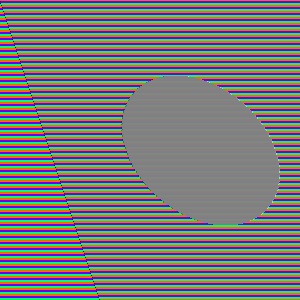
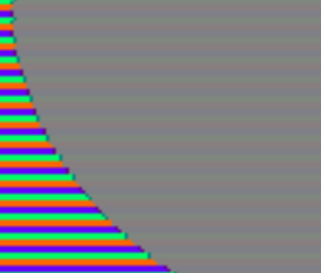
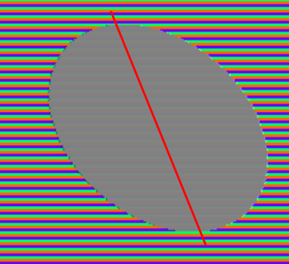
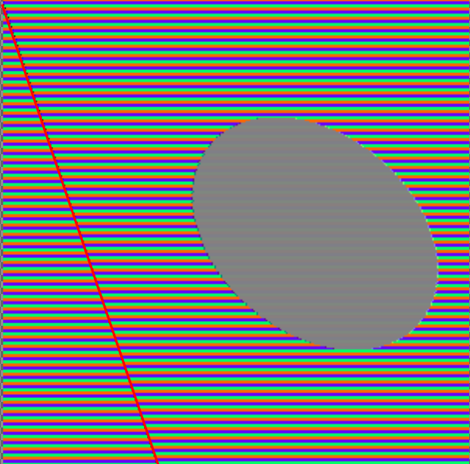

# The Grey Cat, The Uncorruptible.

This is a proof of concept for
[this post](https://www.reddit.com/r/Bossfight/comments/1fiy1pt/the_grey_cat_the_uncorruptible/)
(original source unknown) which I found interesting
enough to develop a minimal implementation.

# Theory

I do not claim to know how the image was generated.
I am however able to propose a proof of concept of how it could
have been implemented by showing a simple image transformation
that produces a similar result.

## Description

The image shows a grey cat on a background of horizontal lines
of irregular color. It is claimed that the file was obtained by
corrupting a normal picture.


The cat exhibits minimal signs of being corrupted by whatever
image transformation has made the background unintelligible.
Paying more attention however reveals that
- the cat _does_ have its color corrupted, it's just not very visible
  (see: evidence 1)
- the cat is subtly tilted to the right (see: evidence 2),
- a wiggly line is visible on the left (see: evidence 3).

## Explanation

I believe this effect is due to the semi-regular deletion or insertion
of R/G/B values that cause occasional 1/3-pixel shifts.

**The nature of a pixel.**
A pixel is (often) represented by a tuple of (R, G, B) components.
`(0, 0, 0)` is black, `(255, 255, 255)` is white, `(128, 128, 128)` is grey, `(255, 0, 0)` is pure red, `(255, 255, 0)` is yellow, `(0, 0, 100)` is a dark blue, etc.

**What is an image anyway ?**
An image is a grid of pixels, so it is stored as
```
R G B R G B R G B
R G B R G B R G B
R G B R G B R G B
```
with pixels grouped as
```
(RGB) (RGB) (RGB)
(RGB) (RGB) (RGB)
(RGB) (RGB) (RGB)
```

**The corruption.**
If one were to insert a single value `X` in the middle it would become
```
R G B R G B R G B
R G B R X G B R G
B R G B R G B R G
```
which is now grouped as
```
(RGB) (RGB) (RGB)
(RGB) (RXG) (BRG)
(BRG) (BRG) (BRG)
```
If RGB was pure red -- `(255, 0, 0)` -- then BRG is now
`(0, 255, 0)` !
By inserting an offset of a third of a pixel, we have transformed
red into green.
This process repeated once every few lines will have the effect
of cycling through colors that are shifts of each other:
red to green to blue back to red.

The appearance of the corrupted pixel RXG in the middle will depend
on the exact value inserted, so the pixel where the insertion occurs
might by different from both of its neighbors.

**Why is grey unaffected ?**
Because grey is invariant by shift.
Shades of grey are when all three R/G/B components are equal,
from very dark grey `(10, 10, 10)` to very light grey `(200, 200, 200)`.
If you take grey and shift it by a third of a pixel it stays grey.

By being the only grey object of the scene, the cat alone survives
the corruption of the image.

# Practice

`main.py` generates images in the
[PPM](https://en.wikipedia.org/wiki/Netpbm) format that illustrate
the corruption at play.

The images that this program generates are visible in the
`img/` folder, and also below in this document if you do not
want to (or cannot) execute the code on your machine.

## Requirements

- a (recent) version of Python 3
- a way to visualize images in the [PPM](https://en.wikipedia.org/wiki/Netpbm) format.
    To this end I can suggest
    - `imagemagick` (command line image conversion), or
    - [`better-pbm-viewer`](https://perso.crans.org/vanille/better-pbm-viewer/) (online PPM visualization)
    - or whatever image visualization tool you have on hand, e.g. Gimp.

## Usage

The source code is in `main.py`.

With the variable `corruption = False`, execute `python3 main.py > img/without.ppm`.
The program creates a PPM image consisting of a solid grey circle on an
orange background.
The image looks like this:


Then set `corruption = True` and execute again, this time saving the image to `img/with.ppm`.
Taking the same image as earlier, the program now occasionally
inserts additional R/G/B values, causing shifts by a fraction of a pixel.
This disrupts the alignment of RGB tuples to pixels and causes a rainbow.
The image is now like this:



Alternatively the bash script `run.sh` will do both of these for you.
Do not trust me, please read or at least skim through any code you execute.
Even if you know neither Python nor Bash it should be easy to check that the
code does not do anything suspicious.

# Evidence

### 1. Chromatic abberration on the cat

 

The cat is not fully unaffected, it does show some signs of
its color being altered. This is because it is not perfectly grey
but a grey with a very light color. Though indistinguishable from
true grey when on its own, it is visibly colored when contrasted
with a different shade of itself.

### 2. Tilt

 

The cat is not upright.
The direction in which it leans suggests that the reconstitution
is not perfect, and the means of corruption is probably deleting
pixels instead of adding them.

### 3. Vertical artifact

 

A vertical-ish line is visible on the left.
Its offset seems to match the tilt of the cat.

The line does not seem to be material, it appears as the contrast
created by the sudden change of color.
Its irregularity in the cat version suggests that the corruption
is much less homogeneous than in the proof of concept.


