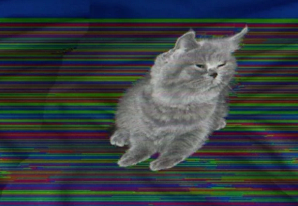
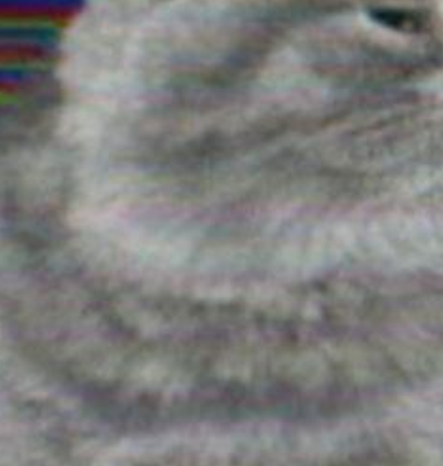
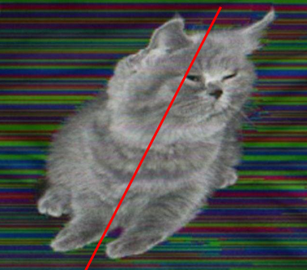
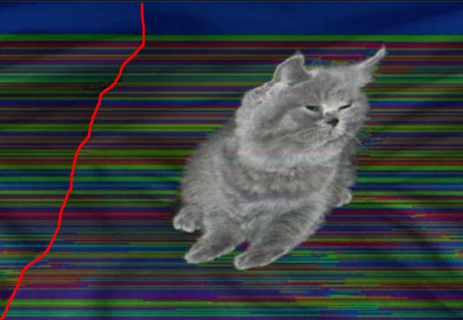
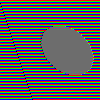

# The Grey Cat, The Uncorruptible.

This is a proof of concept for
[this post](https://www.reddit.com/r/Bossfight/comments/1fiy1pt/the_grey_cat_the_uncorruptible/)
(original source unknown) which I found interesting
enough to develop a minimal implementation.

# Theory

I do not claim to know how the image was generated.
I am however able to propose a proof of concept of how it could
have been implemented by showing a simple image transformation
that produces a similar result.

## Description

The image shows a grey cat on a background of horizontal lines
of irregular color. It is claimed that the file was obtained by
corrupting a normal picture.

The cat exhibits minimal signs of being corrupted by whatever
image transformation has made the background unintelligible.
Paying more attention however reveals that
- the cat _does_ have its color corrupted, it's just not very visible
  (see: evidence 1)
- the cat is inexplicably tilted to the right (see: evidence 2),
- a line is visible on the left (see: evidence 3).

## Evidence

### 1. Chromatic abberration on the cat

The cat is not fully unaffected, it does show some signs of
its color being altered.

### 2. Tilt

The cat is not upright.

### 3. Vertical artifact

A vertical-ish line is visible on the left.
Its offset seems to match the tilt of the cat.

# Practice

## Requirements

- a (recent) version of Python 3
- a way to visualize images in the [PPM](https://en.wikipedia.org/wiki/Netpbm) format.
    To this end I can suggest
    - `imagemagick` (offline image conversion), or
    - [`better-pbm-viewer`](https://perso.crans.org/vanille/better-pbm-viewer/) (online PPM visualization)

## Usage

The source code is `main.py`.

With the variable `corruption = False`, execute `python3 main.py > without.ppm`.
The image looks like this:

Then set `corruption = True` and execute again, this time saving the image to `with.ppm`.
The image is now like this:

